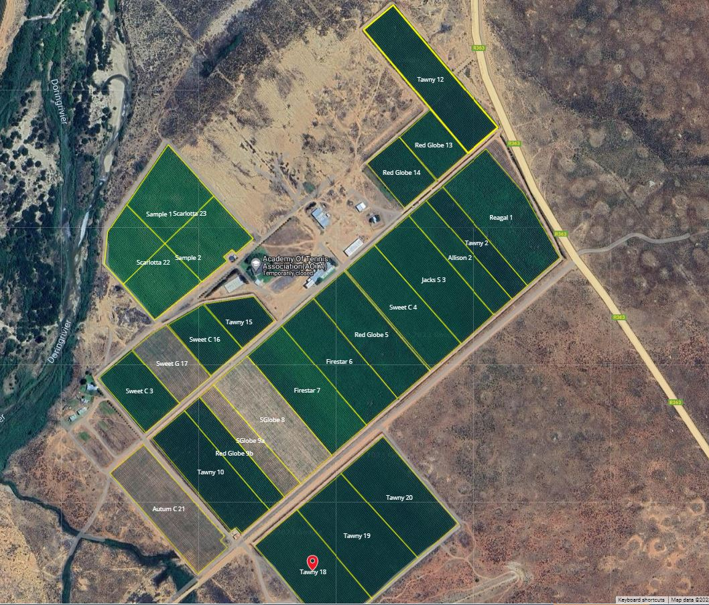
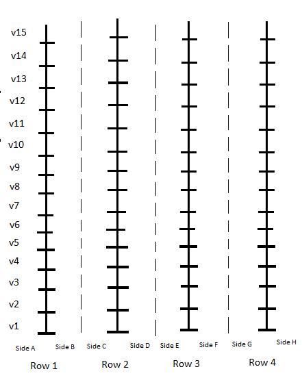

# Doringrivier Trust Datasets documentation:

Doringrivier trust values its data. The aim of the organization to follow a data driven approach to farming.  This document describes all of the different datasets that is present on the farm. All of these datasets will be stored in one centralized database, which will hosted in the cloud.

<h2>Outline</h2>

**Doringrivier trust have the following datasets:**

1. The irrigation dataset
2. The spraying dataset
3. The vine dataset(s)
4. The labour dataset

<h3><u>The Irrigation dataset</u></h3>

The irrigation dataset describes the irrigation patterns on the farm.

<h3><u>The Spraying dataset</u></h3>

The spraying dataset contains all of the information that relates to spraying records on the farm.

<h3><u>The Vine dataset(s):</u></h3>

The vine datasets contains information pertaining to vines planted on the farm. So for example any experiments done on the farm vines will be stored  in one of these datasets.

Each  of the vines  on our farm can be uniquely identified by the following factors:

1. The block number
2. The row number
3. The vak (afrikaans word) it was planted in.
4. The vine number

<h3> <strong>Vine coordinate system</strong> </h3>

Any vineyard will have the following components namely: blocks; columns; rows; sides; and vines. From this fact a coordinate system can be designed to map each vine on our farm. 

<h3> <strong>Blocks</strong> </h3>

Blocks is large pieces of land with vines planted in a row wise fashion. Hopefully the following photo will illustrate what I mean by blocks.

The following picture illustrates the coordinate system we use on our farm. The following picture illustrates the coordinate system that we have on our farm.  The picture will illustrate a block or vineyard of table grapes.  The lines that looks like train tracks is called rows. The $v1 , v2... vn$ notation illustrates the spaces between the rows where  each  of the vines is planted.

